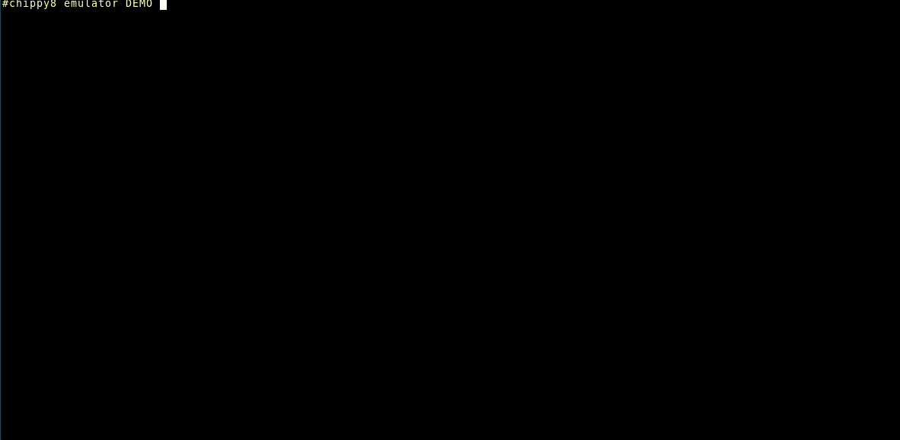

# Chippy8

Chip8 emulator, assembler, disassembler, with simplistic
[`curses`](https://docs.python.org/3/library/curses.html) debugging interface.

## Requirements

Chipp8 has been tested with python3.8.

Install the requirements with:

`pip install -r requirements.txt`

## Usage

### Demo

To assemble the simple demo program:

`chippy8 asm demo/23.asm demo_23.c8`

To run it:

`chippy8 emulator demo_23.c8`

To run it in debug mode:

`chippy emulator -d demo_23.c8`

### Chippy8 Assembler

`chippy8 asm PROGRAM.asm BINARY`

Assembles `PROGRAM.asm` into the Chip8 binary file `BINARY`

### Chippy8 Disassembler

`chippy8 disasm BINARY OUT.asm`

Disassembles `BINARY`, writting the assembly code into `OUT.asm`

### Chippy8 Emulator

`chippy8 emulator BINARY`

Execute `BINARY` using on the chip8 emulator.

Optional flags:

- `-d`: run in debug mode, displaying current registry values, and program
execution flow. `SPACE` key will stop execution. `n` key will execute
instructions step by step.
- `-b`: add a breakpoint at the start of the program. Use the `n` key for step
by step execution. Ignored if not in debug mode (`-d`).
- `-f FREQ`: specify (approximate) CPU frequency. Defaults to 60Hz
